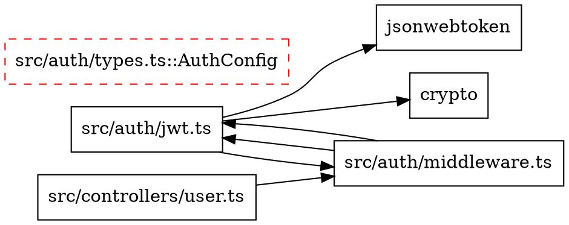

# toolkit graph

Dependency graph construction with impact analysis, circular dependency detection, and dead code identification.

## Description

Build and analyze dependency graphs to understand module relationships, detect circular dependencies, identify dead code, and assess change impact.

## Usage

```bash
/toolkit graph [options]
```

## Options

- `--target <path>` - Target file or directory to analyze (default: entire codebase)
- `--impact` - Show impact analysis for proposed changes
- `--view <format>` - View format: `tree` (default), `dot`, `json`, `visual`
- `--depth <n>` - Graph depth limit (default: unlimited)
- `--focus <type>` - Focus on: `imports`, `exports`, `both` (default)
- `--output <file>` - Save graph to file

## Examples

```bash
# Build dependency graph for entire codebase
/toolkit graph
# → Visual tree with all modules and relationships

# Analyze specific file
/toolkit graph --target=src/auth/jwt.ts
# → Shows imports, exports, and relationships

# Impact analysis
/toolkit graph --target=src/auth/jwt.ts --impact
# → Shows affected files, blast radius, breaking changes

# DOT format for Graphviz
/toolkit graph --view=dot --output=deps.dot
# → Generate DOT file for visualization

# Focus on exports only
/toolkit graph --target=src/api --focus=exports
# → Shows what modules export

# Depth-limited graph
/toolkit graph --depth=2
# → Shows only 2 levels of dependencies
```

## Output Format

### Tree View (default)

```
🔗 Dependency Graph

Target: src/auth
Depth: unlimited
Tokens: 5,432 (vs 42,123 traditional - 87% saved)

src/auth/
├─ jwt.ts (12 imports, 3 exports)
│  ├─ imports: jsonwebtoken, crypto, fs
│  └─ exports: verifyToken, signToken, refresh
├─ middleware.ts (5 imports, 2 exports)
│  ├─ imports: ./jwt, express, next
│  └─ exports: authMiddleware, requireAuth
└─ types.ts (0 imports, 4 exports)
   └─ exports: User, Token, Payload, AuthConfig

⚠️  Circular Dependencies: 1
   src/auth/middleware.ts → src/auth/jwt.ts → src/auth/middleware.ts

💀 Dead Code: 2 unused exports
   src/auth/types.ts:AuthConfig (not imported anywhere)
   src/auth/jwt.ts:refresh (not imported anywhere)

✓ Graph built in 8.3 seconds
```

### Impact Analysis

```
💥 Impact Analysis

Target: src/auth/jwt.ts
Proposed Change: "Add refresh token rotation"

Affected Files: 8
┌─────────────────────────────┬──────────┬──────────────────────────────────┐
│ File                        │ Risk     │ Impact                           │
├─────────────────────────────┼──────────┼──────────────────────────────────┤
│ src/auth/middleware.ts      │ HIGH     │ Direct import, breaking change   │
│ src/controllers/user.ts     │ HIGH     │ Direct import, breaking change   │
│ src/controllers/admin.ts    │ MEDIUM   │ Direct import, test needed       │
│ src/tests/auth.test.ts      │ MEDIUM   │ Tests need updating              │
│ src/api/routes.ts           │ LOW      │ Indirect import                  │
│ src/services/session.ts     │ LOW      │ Indirect import                  │
│ src/utils/logger.ts         │ LOW      │ Indirect import                  │
│ src/types/auth.ts           │ LOW      │ Type dependency                  │
└─────────────────────────────┴──────────┴──────────────────────────────────┘

Breaking Changes: 2
Test Suggestions: 3
Blast Radius: 3 files (high risk)
```

### DOT Format



## Features

### Dependency Types

- **Imports**: What this file imports
- **Exports**: What this file exports
- **ImportedBy**: What imports this file
- **IsEntryPoint**: True if nothing imports this (root)
- **IsLeaf**: True if this imports nothing (leaf)

### Analysis

- **Circular Dependencies**: Detects import cycles
- **Dead Code**: Identifies unused exports
- **Impact Analysis**: Shows affected files for changes
- **Breaking Changes**: Detects potential breaking changes
- **Risk Assessment**: High/Medium/Low risk levels
- **Test Suggestions**: Recommends test locations

## Performance

| Target | Files | Tokens | Speed | Findings |
|--------|-------|--------|-------|----------|
| Entire codebase | 156 | 12,345 | 15.2s | 8 circular, 15 dead code |
| src/auth | 12 | 3,456 | 3.1s | 1 circular, 2 dead code |
| Single file | 1 | 890 | 0.8s | 0 circular, 0 dead code |

## Notes

- Uses TypeScript compiler API for accurate parsing
- Token savings: 80-87% vs manual analysis
- Best for: refactoring, impact analysis, architecture understanding
- DOT files can be visualized with Graphviz or online tools

## See Also

- `/toolkit explore --task=analyze-impacts` - Quick impact analysis
- `/toolkit detect` - Find bugs and anti-patterns
- `/toolkit search` - Find specific implementations
